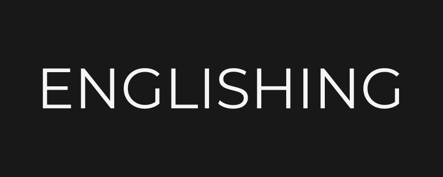

<h3 align="center">
  🚀 Englishing
</h3>

“Não espere para plantar, apenas tenha paciência para colher”!</blockquote>

  <a href="#rocket-about-the-system">About the system</a>&nbsp;&nbsp;&nbsp;|&nbsp;&nbsp;&nbsp;
  <a href="#pencil2-figma-layout">Figma layout</a>&nbsp;&nbsp;&nbsp;|&nbsp;&nbsp;&nbsp;
  <a href="#rocket-how-to-use">How to use?</a>&nbsp;&nbsp;&nbsp;|&nbsp;&nbsp;&nbsp;
  <a href="#page_facing_up-roadmap">Roadmap</a>&nbsp;&nbsp;&nbsp;|&nbsp;&nbsp;&nbsp;

## :rocket: About the system

- This system is created to help english students to decorate english verbs
- We are using on frontend **`NextJS`**
- We are using to layout **`Figma`**

## :pencil2: Figma layout

- <a href="https://www.figma.com/file/CFhwMArWtcd93F8YIJXiQu/Englishing">Link to figma</a>
## :rocket: How to use

- Clone github project **`git clone https://github.com/ebnersilva/englishing`**
- **`cd englishing`**
- Run **`npm install`**
- Start the application with **`npm run dev`**

## :page_facing_up: Roadmap

- [X] - Figma Layout
- [X] - Base project with nextJS
- [X] - UI component middle container respecting design system
- [ ] - UI component info container respecting design system
- [ ] - UI component config container respecting design system
- [X] - Countdown
- [X] - Logic to change the verbs with the time stipulated on countdown
- [ ] - Logic to make with decorated the verb

Feito com 💜 by <a href="https://github.com/ebnersilva">Ebner Silva</a> and <a href="https://github.com/carlosrodrigues94">Carlos Rodrigues</a> :wave:
